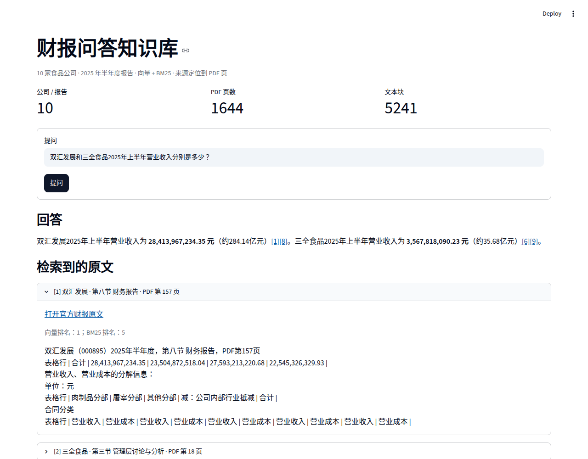

# 财报问答知识库

作业 3 · 方向 A。基于开源项目 [Unravel](https://github.com/jvorndran/RAG-Visualizer) 扩展的财报检索问答：从巨潮资讯下载 10 家食品公司的 **2025 年半年度报告全文**，按 PDF 页提取文字并保留表格行，再用 BGE 向量检索、中文 BM25 与 RRF 融合召回原文。DeepSeek 根据召回片段作答，引用可直接打开官方 PDF 的对应页。

| 语料 | 检索规模 | 10 题记录 |
| --- | ---: | --- |
| 10 家公司、10 份报告、1,644 页 | 5,241 个文本块 | 8 题正确；第 9 题错误，第 10 题部分正确 |

第 9、10 题都是跨公司问题：前 10 个召回块的公司覆盖不足。实际回答、召回来源与人工核对结论均保留在评估记录中。

## 交付材料

- [问答页面截图](deliverables/qa.png)
- [10 道题及召回、回答、人工判定](unravel/finance/evaluation.json)
- [一页结论 PDF](deliverables/conclusion.pdf)
- [报告清单与官方 PDF 地址](unravel/finance/reports.json)



## 运行财报问答

在仓库根目录，使用已有 Python 环境执行：

```bash
python -m unravel.finance.build  # 首次运行时下载报告并建立索引
python -m unravel.cli --port 8503
```

`unravel` 命令默认打开财报页，`unravel --app playground` 可打开原有可视化工具。运行需要 `pdftotext`（Poppler）及相应 Python 依赖，详见[复现说明](docs/finance/README.md)。

DeepSeek 密钥放在仓库根目录的 `.env` 中，格式为 `DEEPSEEK_API_KEY=...`。下载的财报 PDF 与检索索引保存在 `~/.unravel/finance-rag/`，不进入仓库。

财报实现位于 [unravel/finance](unravel/finance/)，提交附件位于 [deliverables](deliverables/)。基础项目的许可文件见 [LICENSE](LICENSE)。
